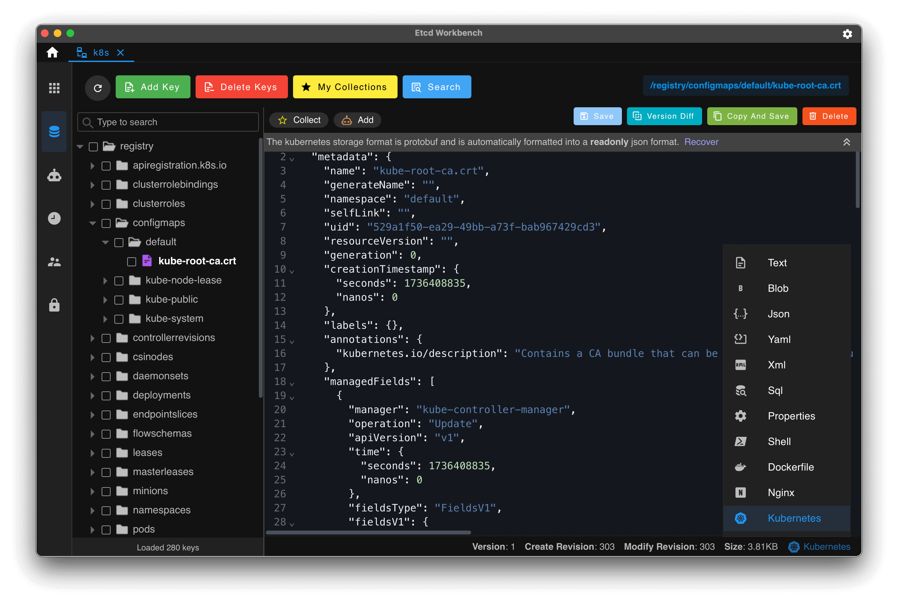
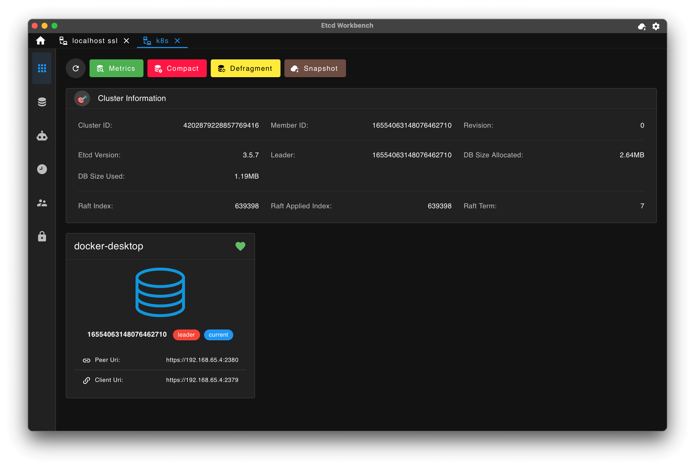
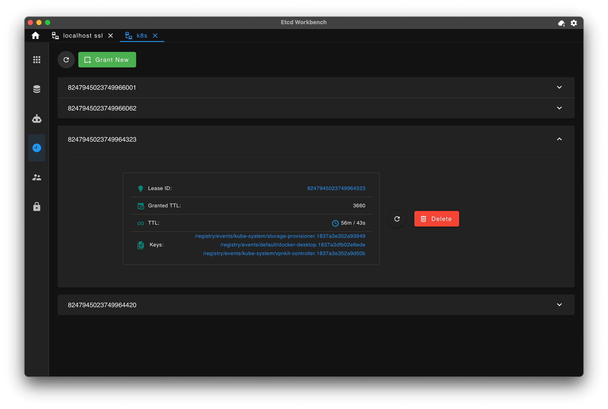
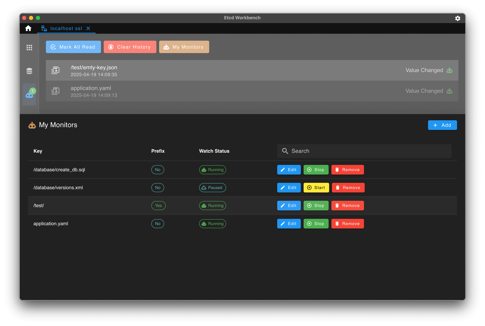
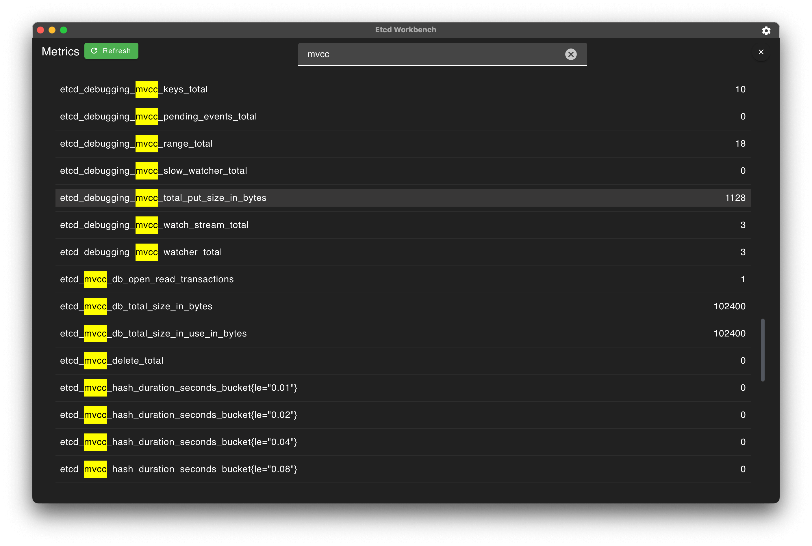
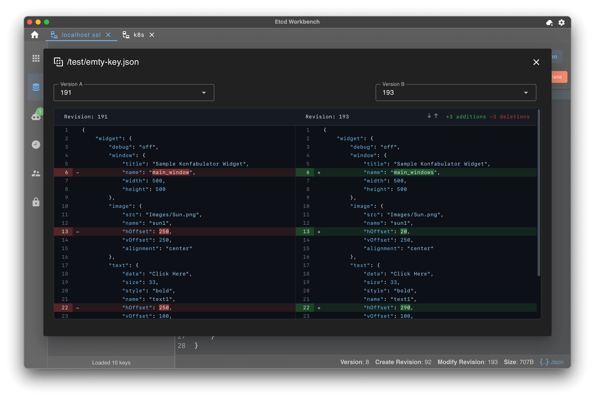

# ShellCN etcd plugin

External ShellCN plugin for [etcd](https://etcd.io) v3. It turns an etcd cluster
into a browsable, editable workspace inside ShellCN.

This plugin is maintained in the ShellCN contrib monorepo. It is still a normal
ShellCN plugin: one Go module, one protocol, one release binary.

## Features

- **Namespaced key tree** — keys are grouped into folders by the `/` separator
  (etcd's convention), with a flat-list toggle. Progressive scanning keeps large
  keyspaces responsive.
- **Value editing** — read, create, update, and delete keys, with JSON
  auto-detection in the editor and lease/revision metadata on the detail view.
- **Leases** — list leases with their TTL, granted TTL, and attached key count;
  grant new leases; revoke leases.
- **Cluster** — member list (name, ID, client/peer URLs, learner flag) and
  endpoint status (version, DB size, leader, raft term/index) on the Status tab.
- **RBAC** — list users and their roles, list roles and permission counts; add
  and delete users and roles; grant and revoke user roles.
- **Live watch** — a streaming tail of PUT/DELETE events under the configured key
  prefix.
- **Maintenance** — compaction and defragmentation of the connected endpoint.
- **Connectivity** — direct or agent (TCP) transport, password / stored-credential
  auth, and TLS from `require` to full verification with optional client
  certificates.

Writes, deletes, RBAC changes, and maintenance are blocked while a connection is
in read-only mode (the default).

## Build

```sh
CGO_ENABLED=0 go build -trimpath -ldflags "-s -w" -o shellcn-plugin-etcd ./cmd/shellcn-plugin-etcd
```

Copy the binary into the gateway plugin directory, restart ShellCN, then enable
it under **Settings -> Protocols**.

## Tests

```sh
go test ./...
# End-to-end against a throwaway etcd container (requires docker):
SHELLCN_ETCD_INTEGRATION=1 go test ./internal/etcd/
# Or point at an existing endpoint:
SHELLCN_ETCD_ADDR=127.0.0.1:2379 SHELLCN_ETCD_INTEGRATION=1 go test ./internal/etcd/
```

## Feature reference

The feature set mirrors [etcd-workbench](https://github.com/tzfun/etcd-workbench)
(GPL-3.0), the reference etcd desktop UI. The screenshots below are from
etcd-workbench and show that reference UI — not the ShellCN interface — to
document the capabilities this plugin exposes through ShellCN's panels.

| | |
|---|---|
| Key editor |  |
| Cluster & members |  |
| Leases |  |
| Live key monitor / watch |  |
| Metrics |  |
| Revision diff |  |
